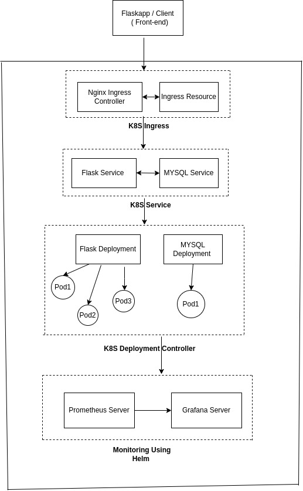

#              **Approach Paper \- Kubernetes Two-Tier Application Deployment & Monitoring**  

# Table of Contenet 

**1. Objective**

**2. Proposed Solutions**

**3. Approach: Details**

**3.1. Architecture Diagram**

**3.2. Description**

**3.3. Pre-requisites**

**3.3.1. Hardware Requirements**

**3.3.2. Software Requirements**

**3.3.3. Networking Requirements**

# 1\. Objective

The objective of this project is to:

* Deploy a **two-tier application (Flask \+ MySQL)** on a **Minikube Kubernetes cluster**.  
* Expose the Flask application using **Kubernetes NodePort Service**.  
* Set up **Prometheus and Grafana** for application monitoring.  
* Create a **Grafana dashboard** to monitor key application metrics.  
* Configure **alerts** for high CPU and memory utilization.  
* Implement an **NGINX Ingress Controller** to make the application accessible over the host.

# 2\. Proposed Solutions

**Kubernetes-Based Deployment with Ingress & Monitoring**

1. **Set up Minikube with necessary tools** (Podman, kubectl).  
2. **Deploy Flask & MySQL using Kubernetes YAML manifests.**  
3. **Expose Flask using NodePort** (`<cluster-node-ip>:<NodePort>`).  
4. **Install Prometheus & Grafana** for monitoring.  
5. **Create a Grafana Dashboard** to visualize:  
   * Total running pods count.  
   * CPU and memory utilization.  
   * Total restart count of pods.  
6. **Set up alerting** to notify via email when CPU/memory thresholds exceed limits.  
7. **Configure NGINX Ingress Controller** to expose the application over the host using domain.

# 

# 

# **3\. Approach: Details**

# 3.1. Architecture Diagram

 K8S Cluster

## 3.2. Description

This approach uses **Kubernetes on Minikube** to deploy a **Flask application** that connects to a **MySQL database**. The application is monitored using **Prometheus and Grafana**, and exposed to the outside cluster on host via an **NGINX Ingress Controller**.

Workflow:

1. **Minikube Cluster Setup:** Install Podman, kubectl, and Minikube.  
2. **Deploy MySQL & Flask:** Define Kubernetes Deployment and Service YAMLs.  
3. **Expose Flask via NodePort:** Access the app at `<cluster-node-ip>:<NodePort>`.  
4. **Install Prometheus & Grafana:** Monitor pod metrics and display them on Grafana dashboards.  
5. **Set Up Alerts:** Configure Prometheus alerts for CPU/memory usage.  
6. **Configure Ingress:** Use the **NGINX Ingress Controller** to make the app publicly accessible.

**Pros & Cons**

**Pros:**

* Efficient container orchestration with Kubernetes.  
* Integrated monitoring via Prometheus and Grafana.  
* Ingress Controller provides external accessibility.  
* Auto-scaling and better fault tolerance.

**Cons:**

* Requires Kubernetes knowledge for setup.  
* Resource-intensive compared to standalone Docker Compose.

## **3.3. Pre-requisites**

## 3.3.1. Hardware Requirements

* **CPU:** Minimum 4-core processor.  
* **RAM:** At least 8GB RAM (Recommended: 16GB).  
* **Storage:** Minimum 50GB free disk space.

## 3.3.2. Software Requirements

* **OS:** Ubuntu 20.04 or above.  
* **Tools:**  
  * Minikube (Latest Version)  
  * kubectl  
  * Podman or Docker  
  * Helm (for Prometheus/Grafana installation)  
  * NGINX Ingress Controller

## 3.3.3. Networking Requirements

* **Minikube Networking:** Cluster network with NodePort access.  
* **Public Internet Access:** Required for exposing the app via Nginx or cloud-based LoadBalancer.
