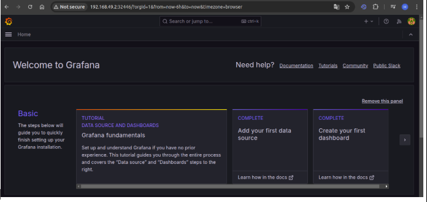

#                **IMPLEMENTATION JOURNAL \-**  **Kubernetes Two-Tier Application Deployment & Monitoring** 

| Submitted By | Himanshu Singh |
| :---- | :---- |
| Submitted To | Vipin Sir |
| Test Case Version | Version 1.0 |
| Reviewer  Name | Vipin Sir |

**Goal \-**

Install and set up a Minikube single-node Kubernetes cluster. Understand the architecture of Kubernetes. Deploy a **two-tier Flask application with MySQL** on the cluster by Kubectl using YAML manifests. Install and set up **Prometheus and Grafana** for monitoring running applications on cluster, setting up **alerts**, and exposing the application to the **internet using the NGINX Ingress Controller**.

***

**Table of Contents**

**Pre-requisites**

**Hardware Requirements**

**Software Requirements**

**Networking Requirements**

**STEPS:**

**STEP 1 \- Install pre-requisites for K8S Cluster (Minikube)- Docker, Kubectl**

**STEP 2 \- Installation of Minikube ( Single-Node Cluster)	6**

**STEP 3 \- Kubernetes ( K8S ) Architecture**

**STEP 4: 2-Tier Application K8S Deployment**

**STEP 5: Installation of K8S Helm package manager**

**STEP 6:  A Namespace for Monitoring Cluster level-group	12**

**STEP 7: Install Prometheus and Grafana Monitoring Tool	13**

**STEP 8: Expose Prometheus and Grafana tool to access via Node**
**STEP 9: Access Prometheus Tool via Node**

**STEP 9: Access Grafana Tool via Node**

**STEP 10: Create Grafana Dashboard for Resource Usage by running application**

**STEP 11: Configure Alert in Grafana installed by Kube-Prometheus-stack via Helm	19**

**STEP 12: Setup Ingress Controller to expose running flask app on host**


## **Pre-requisites**

## Hardware Requirements

* **CPU:** Minimum 4-core processor.  
* **RAM:** At least 8GB RAM (Recommended: 16GB).  
* **Storage:** Minimum 50GB free disk space.

## Software Requirements

* **OS:** Ubuntu 20.04 or above.  
* **Tools:**  
  * Minikube (Latest Version)  
  * kubectl  
  * Podman or Docker  
  * Helm (for Prometheus/Grafana installation)  
  * NGINX Ingress Controller

## Networking Requirements 

* **Minikube Networking:** Cluster network with NodePort access.  
* **Public Internet Access:** Required for exposing the app via Nginx or cloud-based LoadBalancer.


## **STEPS**: {#steps:}

## STEP 1 \- Install pre-requisites for K8S Cluster (Minikube)- Docker, Kubectl

## Command executed \-   
Note \- Use official documentation to install Docker and Kubectl

[https://docs.docker.com/engine/install/ubuntu/\#install-using-the-repository] 

[https://kubernetes.io/docs/tasks/tools/install-kubectl-linux/\#install-kubectl-binary-with-curl-on-linux]

### 1 .1 \- Install Docker

```
# Add Docker's official GPG key:
sudo apt-get update
sudo apt-get install ca-certificates curl
sudo install -m 0755 -d /etc/apt/keyrings
sudo curl -fsSL https://download.docker.com/linux/ubuntu/gpg -o /etc/apt/keyrings/docker.asc
sudo chmod a+r /etc/apt/keyrings/docker.asc

# Add the repository to Apt sources:
echo \
  "deb [arch=$(dpkg --print-architecture) signed-by=/etc/apt/keyrings/docker.asc] https://download.docker.com/linux/ubuntu \
  $(. /etc/os-release && echo "${UBUNTU_CODENAME:-$VERSION_CODENAME}") stable" | \
  sudo tee /etc/apt/sources.list.d/docker.list > /dev/null
sudo apt-get update

# Install the Docker packages
sudo apt-get install docker-ce docker-ce-cli containerd.io docker-buildx-plugin docker-compose-plugin
```

### 

### 1.2 \- Install the Kubectl tool 

```
# Download the latest release 
 curl -LO "https://dl.k8s.io/release/$(curl -L -s https://dl.k8s.io/release/stable.txt)/bin/linux/amd64/kubectl"

# Download the Kubectl checksum file 
curl -LO "https://dl.k8s.io/release/$(curl -L -s https://dl.k8s.io/release/stable.txt)/bin/linux/amd64/kubectl.sha256"

# Install Kubectl 
sudo install -o root -g root -m 0755 kubectl /usr/local/bin/kubectl
```
## Command output \- 

```
# Docker Version
$ docker -v
Docker version 28.0.2, build 0442a73

# check kubectl version
$ kubectl version --client
Client Version: v1.32.1
Kustomize Version: v5.5.0
```

## STEP 2 \- Installation of Minikube ( Single-Node Cluster) 

## Command executed \- 

```
# Install the latest minikube stable release on x86_64 Linux using the Debian package
curl -LO https://storage.googleapis.com/minikube/releases/latest/minikube_latest_amd64.deb
sudo dpkg -i minikube_latest_amd64.deb

# Start the cluster using docker driver
Minikube start --driver=docker
```
## Command output \- 

```
$ minikube start
😄  minikube v1.35.0 on Ubuntu 22.04
✨  Using the docker driver based on existing profile
👍  Starting "minikube" primary control-plane node in "minikube" cluster
🚜  Pulling base image v0.0.46 ...
🔄  Restarting existing docker container for "minikube" ...
🐳  Preparing Kubernetes v1.32.0 on Docker 27.4.1 ...
🔎  Verifying Kubernetes components...
    ▪ Using image gcr.io/k8s-minikube/storage-provisioner:v5
    ▪ Using image registry.k8s.io/ingress-nginx/controller:v1.11.3
    ▪ Using image registry.k8s.io/ingress-nginx/kube-webhook-certgen:v1.4.4
    ▪ Using image registry.k8s.io/ingress-nginx/kube-webhook-certgen:v1.4.4
🔎  Verifying ingress addon...
🌟  Enabled addons: storage-provisioner, ingress, default-storageclass
🏄  Done! kubectl is now configured to use "minikube" cluster and "default" namespace by default

$ minikube status
minikube
type: Control Plane
host: Running
kubelet: Running
apiserver: Running
kubeconfig: Configured
```
## STEP 3 \- Kubernetes ( K8S ) Architecture

Kubernetes (K8s) architecture is based on a **master-slave** structure, where the **Control Plane** (Master) is responsible for managing the cluster and making decisions, while the **Worker Nodes** are responsible for running the applications in containers. Here's a brief description of the components involved:

#### **3.1. Kubernetes Cluster Structure:** 

* **K8s Cluster \= Control Plane \+ Worker Nodes**  
   The cluster is composed of two main parts:  
  * **Control Plane**: Manages the overall state of the cluster, including scheduling, maintaining cluster state, and responding to changes in the cluster.  
  * **Worker Nodes**: These nodes run the containerized applications in the form of **pods**.

#### **3.2. Control Plane Components:**

The **Control Plane** manages the cluster and is responsible for managing the worker nodes and the lifecycle of applications. The components of the control plane are:

* **Kube-API Server**: The API server is the frontend of the Kubernetes control plane. It exposes the Kubernetes API and serves as the entry point for commands, configuration, and communication with other components. All other components interact with the API server.

* **Scheduler**: The scheduler is responsible for selecting which node (worker machine) will run a newly created pod. It does this based on available resources and other factors.

* **Etcd**: Etcd is a key-value store used for storing cluster data, including the configuration and state of all objects (such as pods, deployments, services, etc.) in the cluster. Etcd ensures that the cluster state is consistent.

* **Controller Manager**: The controller manager is responsible for ensuring that the desired state of the cluster is maintained. It monitors the state of the cluster and takes corrective actions if the actual state diverges from the desired state. Examples of controllers include deployment controllers, replica controllers, etc.

#### **3.3. Worker Node Components:** 

The **Worker Nodes** are responsible for running the actual applications in containers (as pods). The components that run on worker nodes include:

* **Kubelet**: The kubelet is an agent that runs on each worker node in the cluster. It ensures that containers are running in pods as expected, communicates with the API server, and reports the node’s status.

* **Kube-Proxy**: Kube-proxy manages network routing within the cluster. It ensures that traffic is forwarded to the appropriate container within a pod, and it handles load balancing and service discovery.

* **Container Runtime**: The container runtime is the software responsible for running containers. Examples include Docker, containerd, or CRI-O. It pulls container images, starts containers, and stops them as needed.

## STEP 4: 2-Tier Application K8S Deployment 

### 4.1. Write k8s yaml manifest file for Flaskapp 

 \- flaskapp-deploy.yml → manage set of flaskapp pods  
 \-  flaskapp-svc.yml → to expose app on node using Nodeport service type

### 

### 4.2. Write k8s yaml manifest file for Mysql db 

\- mysql-deploy.yml → manage set of mysql pods  
\- mysql-svc.yml → to expose database for flaskapp using clusterIP service type   
\- mysql-pv.yml → provisioned a storage resource in k8s cluster  
\- mysql-pvc.yml \- claim persistent volume for pods for mysql database

### 4.3. Apply all k8s resources manifest using kubectl  

### Command executed \-  

```
# Deploy the k8s resources using kubectl apply command 
kubectl apply -f mysql-pv.yml
kubectl apply -f mysql-pvc.yml
kubectl apply -f mysql-deploy.yml
kubectl apply -f mysql-svc.yml
kubectl apply -f flaskapp-deploy.yml
kubectl apply -f flaskapp-svc.yml
```
### Command output \- 

```
# verify the k8s deployment
$ kubectl get deploy
NAME       READY   UP-TO-DATE   AVAILABLE   AGE
flaskapp   3/3     3            3           49d
mysql      1/1     1            1           49d

# Get all the running pods deployed using k8s deploy
$ kubectl get pods
NAME                       READY   STATUS             RESTARTS       AGE
flaskapp-8d6f6b944-5gf6v   1/1     Running            19 (9h ago)    17d
flaskapp-8d6f6b944-7rsnb   1/1     Running            34 (9h ago)    29d
flaskapp-8d6f6b944-rtgqh   1/1     Running            82 (9h ago)    49d
mysql-7649d64f8-tcmsp      1/1     Running            22 (10h ago)   49d
two-tier-app-pod           0/1     CrashLoopBackOff   6 (99s ago)    9m21s

# List all services deployed
$ kubectl get svc
NAME         TYPE        CLUSTER-IP       EXTERNAL-IP   PORT(S)        AGE
flaskapp     NodePort    10.96.156.248    <none>        80:30007/TCP   49d
kubernetes   ClusterIP   10.96.0.1        <none>        443/TCP        49d
mysql        ClusterIP   10.100.221.192   <none>        3306/TCP       49d

# List all persistentvolumes 
$ kubectl get pv
NAME       CAPACITY   ACCESS MODES   RECLAIM POLICY   STATUS   CLAIM               STORAGECLASS   VOLUMEATTRIBUTESCLASS   REASON   AGE
mysql-pv   3Gi        RWO            Retain           Bound    default/mysql-pvc   manual         <unset>                          49d

# List all persistentvolumeclaims
$ kubectl get pvc
NAME        STATUS   VOLUME     CAPACITY   ACCESS MODES   STORAGECLASS   VOLUMEATTRIBUTESCLASS   AGE
mysql-pvc   Bound    mysql-pv   3Gi        RWO            manual         <unset>                 49d

```
### 4.4 → Access Flaskapp using cluster node IP address and Node Port  in the browser 

```
Here in case of Minikube
 \- get minikube node ip ( minikube ip \- command)
$ minikube ip
192.168.49.2 

 \- get NodePort define in flaskapp-svc.yml manifest
```


## STEP 5: Installation of K8S Helm package manager 

## Command executed \- 

```
# Run script to install helm
$ curl -fsSL -o get_helm.sh      https://raw.githubusercontent.com/helm/helm/main/scripts/get-helm-3
 chmod 700 get_helm.sh
./get_helm.sh
```
## Command output \-  

```
$ helm version
version.BuildInfo{Version:"v3.17.0", GitCommit:"301108edc7ac2a8ba79e4ebf5701b0b6ce6a31e4", GitTreeState:"clean", GoVersion:"go1.23.4"}
```
## 

## STEP 6:  A Namespace for Monitoring Cluster level-group 

## Command executed \-

```
$ kubectl create namespace monitoring 
```

##  Command output \-    

```
$ kubectl get namespace
NAME              STATUS   AGE
default           Active   49d
ingress-nginx     Active   39d
kube-node-lease   Active   49d
kube-public       Active   49d
kube-system       Active   49d
monitoring        Active   49d|
```

## STEP 7: Install Prometheus and Grafana Monitoring Tool 

## Command executed \- 

```
# Add Prometheus package using Helm Package Manager
$  helm repo add prometheus-community    https://prometheus-community.github.io/helm-charts
helm repo add grafana https://grafana.github.io/helm-charts
helm repo update

 # Install Prometheus-stack Tools
$ helm install prometheus prometheus-community/kube-prometheus-stack --namespace monitoring
```
## Command Output \- 

```
$ kubectl get pods -n monitoring
NAME                                                        READY   STATUS    RESTARTS       AGE
alertmanager-kube-prometheus-stack-alertmanager-0           2/2     Running   18 (13h ago)   32d
kube-prometheus-stack-grafana-7bdbbd7777-h5vlt              3/3     Running   54 (12h ago)   23d
kube-prometheus-stack-kube-state-metrics-8445d5c76f-zrjtq   1/1     Running   93 (12h ago)   32d
kube-prometheus-stack-operator-7d6988d4bf-dhkdj             1/1     Running   84 (12h ago)   32d
kube-prometheus-stack-prometheus-node-exporter-cstqx        1/1     Running   13             28d
prometheus-kube-prometheus-stack-prometheus-0               2/2     Running   15 (13h ago)   25d

```
## STEP 8: Expose Prometheus and Grafana tool to access via Node 

##  Command executed \- 

```
# List all the services running by Prometheus-stack 
kubectl get svc -n monitoring
NAME                                             TYPE        CLUSTER-IP      EXTERNAL-IP   PORT(S)                         AGE
alertmanager-operated                            ClusterIP   None            <none>        9093/TCP,9094/TCP,9094/UDP      32d
kube-prometheus-stack-alertmanager               ClusterIP   10.101.108.45   <none>        9093/TCP,8080/TCP               32d
kube-prometheus-stack-grafana                    ClusterIP   10.107.22.36    <none>        80/TCP                          32d
kube-prometheus-stack-kube-state-metrics         ClusterIP   10.110.19.48    <none>        8080/TCP                        32d
kube-prometheus-stack-operator                   ClusterIP   10.96.217.185   <none>        443/TCP                         32d
kube-prometheus-stack-prometheus                 ClusterIP   10.108.68.189   <none>        9090/TCP,8080/TCP               32d
kube-prometheus-stack-prometheus-node-exporter   ClusterIP   10.111.42.207   <none>        9100/TCP                        32d
prometheus-operated                              ClusterIP   None            <none>        9090/TCP                        32d

# Expose Prometheus and Grafana using K8S NodePort Service
$ kubectl expose service prometheus-kube-prometheus-prometheus --type=NodePort --target-port=9090 --name=prometheus-server -n monitoring 

$ kubectl expose service prometheus-grafana --type=NodePort --target-port=3000 --name prometheus-grafana-server -n monitoring
```
##  Command Output \- 

```
Verify the new NodePort services exposed 
$ kubectl get svc -n monitoring
NAME                                             TYPE        CLUSTER-IP      EXTERNAL-IP   PORT(S)                         AGE
alertmanager-operated                            ClusterIP   None            <none>        9093/TCP,9094/TCP,9094/UDP      32d
kube-prometheus-stack-alertmanager               ClusterIP   10.101.108.45   <none>        9093/TCP,8080/TCP               32d
kube-prometheus-stack-grafana                    ClusterIP   10.107.22.36    <none>        80/TCP                          32d
kube-prometheus-stack-kube-state-metrics         ClusterIP   10.110.19.48    <none>        8080/TCP                        32d
kube-prometheus-stack-operator                   ClusterIP   10.96.217.185   <none>        443/TCP                         32d
kube-prometheus-stack-prometheus                 ClusterIP   10.108.68.189   <none>        9090/TCP,8080/TCP               32d
kube-prometheus-stack-prometheus-node-exporter   ClusterIP   10.111.42.207   <none>        9100/TCP                        32d
prometheus-grafana-server                        NodePort    10.103.71.165   <none>        80:32189/TCP                    32d
prometheus-operated                              ClusterIP   None            <none>        9090/TCP                        32d
prometheus-server                                NodePort    10.98.141.231   <none>        9090:30602/TCP,8080:32738/TCP   32d
```

## STEP 8: Access Prometheus Tool via Node 

## Command executed \- 

```
# check Node ip
$ minikube ip
192.168.49.2

# check NodePort service Port number
$ kubectl get svc -n monitoring | grep NodePort
prometheus-grafana-server                        NodePort    10.103.71.165   <none>        80:32189/TCP                    32d
prometheus-server                                NodePort    10.98.141.231   <none>        9090:30602/TCP,8080:32738/TCP   32d
```
## Command Output \- 


## STEP 9: Access Grafana Tool via Node

## Command executed \-   

```
Generate password for Grafana Login
$ kubectl get secret prometheus-grafana -n monitoring -o jsonpath="{.data.admin-password}" | base64 --decode
Output  → prom-operator

$ kubectl get svc -n monitoring | grep NodePort
prometheus-grafana-server                        NodePort    10.103.71.165   <none>        80:32189/TCP                    32d
prometheus-server                                NodePort    10.98.141.231   <none>        9090:30602/TCP,8080:32738/TCP   32d
```

## Command Output \- 

```
Note \- Use this default credentials to login Grafana  
           User \- admin  
           Password \- prom-operator
```


## STEP 10: Create Grafana Dashboard for Resource Usage by running application 

## 10.1. Add Prometheus server as data source in Grafana Dashboard

 Login to Grafana Portal → home → Connection → Data Sources → Add a new data source →  
 Select Prometheus → Save and Test

## 10.2. Use the below metrics to get the data from Prometheus server 

```
# To check total number of pods running for flaskapp in a "default" namespace 
count(kube_pod_status_phase{namespace="default", phase="Running"})

# To check total number of pods restarted for flaskapp in a "default" namespace                sum(kube_pod_container_status_restarts_total{namespace="default"})

# To check CPU usage by each pod for flaskapp in default namespace
 sum(container_cpu_load_d_average_10s{namespace="default"}) by (pod)

# To check Memory usage(in MB)  by each pod for flaskapp in default namespace 
sum(container_memory_usage_bytes{namespace="default"}) by (pod) /1024 /1024
```
## 10.3. Create Dashboard for Resource Usage by Pods in Grafana  


## STEP 11: Configure Email Alert in Grafana via Helm  

##  11.1. Create contact point for email to get Alert from Grafana Dashboard.

## 11.2. Create k8s secret to store sensitive data for SMTP server  

## Command executed \- 

```
$ kubectl create secret generic grafana-smtp-secret -n monitoring \
  --from-literal=smtp-password="ubit xwiq jumt oczu"
secret/grafana-smtp-secret created
hp@hp9003:~/project_k8s$ kubectl get secret grafana-smtp-secret
Error from server (NotFound): secrets "grafana-smtp-secret" not found
hp@hp9003:~/project_k8s$ kubectl get secret grafana-smtp-secret -n monitoring
NAME                  TYPE     DATA   AGE
grafana-smtp-secret   Opaque   1      68s

```

## 11.3. Get the helm values yaml file to update the grafana helm chart configuration 

## Command executed \- 

```
hp@hp9003:~/project_k8s$ helm get values kube-prometheus-stack -n monitoring --all > grafana-values.yaml
```
## 11.4. Edit the grafana-values.yaml file to enable and configure SMTP in Grafana 

```
grafana.ini:
    smtp:
      enabled: true
      host: "smtp.gmail.com:587"
      user: "himanshuindian123@gmail.com"
      from_address: "himanshuindian123@gmail.com"
      from_name: "Grafana Alerts"
      startTLS_policy: "Require"
      password: $__file{/etc/secrets/smtp-password}  
                 # Read from mounted secret file
  extraSecretMounts:
    - name: grafana-smtp-secret
      secretName: grafana-smtp-secret  # The name of your Kubernetes Secret
      mountPath: /etc/secrets
      subPath: ""
      readOnly: true
```

##  11.5. After modifying the grafana-values.yaml file upgrade helm deployment 

## Command executed \- 

```
$ helm upgrade kube-prometheus-stack prometheus-community/kube-prometheus-stack -n monitoring -f grafana-values.yaml
```

## Command output \-

```
Release "kube-prometheus-stack" has been upgraded. Happy Helming!
NAME: kube-prometheus-stack
LAST DEPLOYED: Thu Feb 27 00:48:43 2025
NAMESPACE: monitoring
STATUS: deployed
REVISION: 4
NOTES:
kube-prometheus-stack has been installed. Check its status by running:
  kubectl --namespace monitoring get pods -l "release=kube-prometheus-stack"

Get Grafana 'admin' user password by running:

  kubectl --namespace monitoring get secrets kube-prometheus-stack-grafana -o jsonpath="{.data.admin-password}" | base64 -d ; echo

Access Grafana local instance:

  export POD_NAME=$(kubectl --namespace monitoring get pod -l "app.kubernetes.io/name=grafana,app.kubernetes.io/instance=kube-prometheus-stack" -oname)
  kubectl --namespace monitoring port-forward $POD_NAME 3000

Visit https://github.com/prometheus-operator/kube-prometheus for instructions on how to create & configure Alertmanager and Prometheus instances using the Operator.
```

## 11.6.  Now Configure Contact Points in Grafana UI 

 1. Go to Alerting \> Contact points  
 2. Click "New contact point"  
 3. Select "Email" as the contact method  
 4. Enter the recipient email address  
 5. Click "Test" to verify email alerts  
 6. Save the contact point

## STEP 12: Setup Ingress Controller to expose running flask app on host  

## 12.1. Write the ingress resource manifest file using yaml file

```
apiVersion: networking.k8s.io/v1
kind: Ingress
metadata:
  name: flaskapp-ingress
  annotations:
    nginx.ingress.kubernetes.io/rewrite-target: /
spec:
  ingressClassName: nginx
  rules:
  - host: "myapp.example.com"
    http:
      paths:
      - pathType: Prefix
        path: /
        backend:
          service:
            name: flaskapp
            port:
              number: 80
```
## 12.2. Install k8s ingress controller for minikube cluster

##  Command executed \- 

```
 # To enable the nginx controller
$ minikube addons enable ingress
💡  ingress is an addon maintained by Kubernetes. For any concerns contact minikube on GitHub.
You can view the list of minikube maintainers at: https://github.com/kubernetes/minikube/blob/master/OWNERS
    ▪ Using image registry.k8s.io/ingress-nginx/kube-webhook-certgen:v1.4.4
    ▪ Using image registry.k8s.io/ingress-nginx/controller:v1.11.3
    ▪ Using image registry.k8s.io/ingress-nginx/kube-webhook-certgen:v1.4.4
🔎  Verifying ingress addon...
🌟  The 'ingress' addon is enabled
```
## Command Output \- 

```
# To verify that nginx ingress controller is running
$ kubectl get pods -n ingress-nginx
NAME                                        READY   STATUS      RESTARTS          AGE
ingress-nginx-admission-create-9wkth        0/1     Completed   0                 42d
ingress-nginx-admission-patch-684jl         0/1     Completed   1                 42d
ingress-nginx-controller-56d7c84fd4-vz59f   1/1     Running     112 (3d13h ago)   42d

# list of all ingress-resource 
$ kubectl get ingress
NAME               CLASS   HOSTS               ADDRESS        PORTS   AGE
flaskapp-ingress   nginx   myapp.example.com   192.168.49.2   80      42d
```
